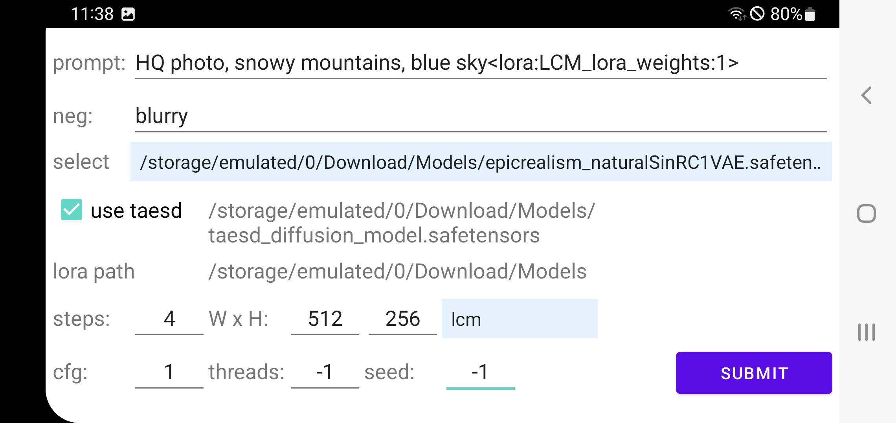
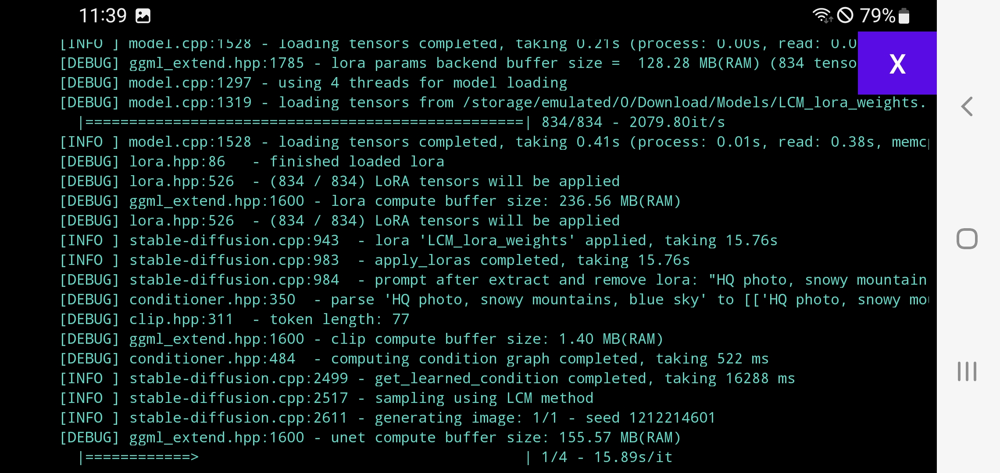
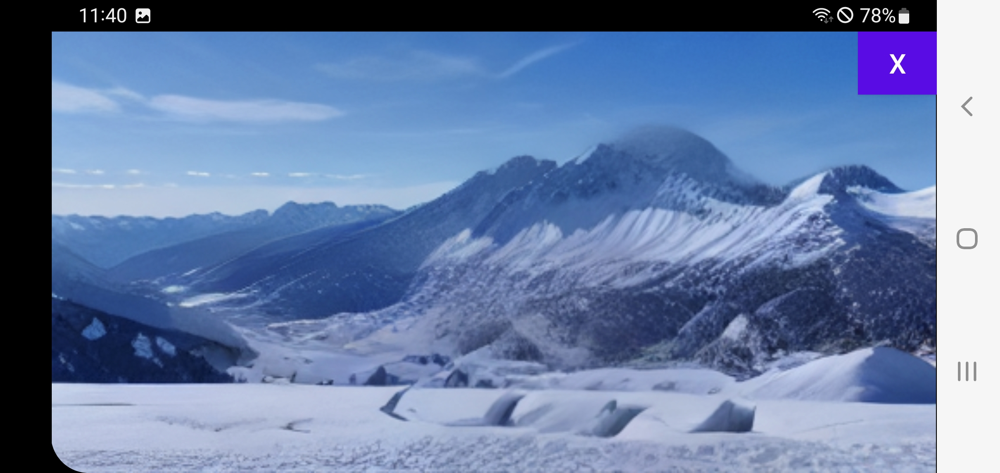

# This is the sdcpp-on-android project

## Purpose:

This project depends entirely on the excellent work of leejet and his contributors writing the **stable-diffusion.cpp** project ( https://github.com/leejet/stable-diffusion.cpp ). Many thanks for their efforts! Note that this implementation only uses a small subset (T2I) of sd.cpp's full feature set.

## Installation Instructions: 

See Build Instructions below. You may need to allow 'Install from unknown sources' when prompted.

## Usage Guide: 

* Download at least one valid stable diffusion model file on your device. For details see:  https://github.com/leejet/stable-diffusion.cpp/blob/master/docs/sd.md    
Download these safetensors or ckpt files using your favorite web browser and store them below 'Download', but you may want to create a dedicated folder (e.g., 'Download/Models') to stay organized.

* Grant permissions: Confirm the required storage permissions (see Security & Privacy Note below).
    
* Generate an image in three steps:

| Step 1: first enter some input:|
| :----- |
|  |


| Step 2: wait some time, depending on your device:|
| :----- |
|  |


| Step 3: view your result:|
| :----- |
|  |
 
The generated image file (PNG) is saved in 'Download' folder, called outputXXXXXXXXXX.png, where XXXXXXXXXX is the Unix timestamp of when the generation started.
        
## Build Instructions: 

Import the project to Android Studio and build it, then execute the built APK on your device by sideloading it via ADB. You also are free to build the native library part by yourself, see below.

## License: 

MIT, the same license as sd.cpp.

## Security & Privacy Note: 

This app requires extensive storage permissions to function. It needs to read access to load the model files you provide and write access to save the generated images. We value your privacy and no data is collected or transmitted by this app. You can verify this by reviewing the source code.

## Native code:
**IMPORTANT**: this project contains compiled code from sd.cpp (commit #59ebdf0b), https://github.com/leejet/stable-diffusion.cpp/commit/59ebdf0bb5b3a6c83d92ca90fd820707fb154e9d  
You are encouraged to build the sd executable yourself using Android NDK, see the sd.cpp build documentation:  https://github.com/leejet/stable-diffusion.cpp/blob/master/docs/build.md     
The included binary was built in Termux using the following commands:
```sh
cmake .. -G Ninja \
  -DCMAKE_TOOLCHAIN_FILE=/data/data/com.termux/files/home/android-ndk-r27b/build/cmake/android.toolchain.cmake \
  -DANDROID_ABI=arm64-v8a \
  -DANDROID_PLATFORM=android-28 \
  -DGGML_OPENMP=OFF \
  -DSD_OPENCL=OFF         # Set to ON if you want to experiment with OpenCL 
ninja 
```
After building replace the included file libsd.so by your newly compiled sd executable. Rename the executable from 'sd' to 'libsd.so' and place it in app/src/main/jniLibs/arm64-v8a folder. (This is needed due android restrictions.)

 
